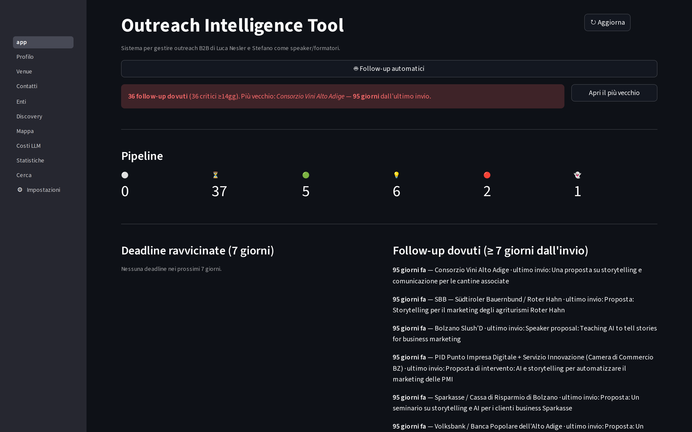
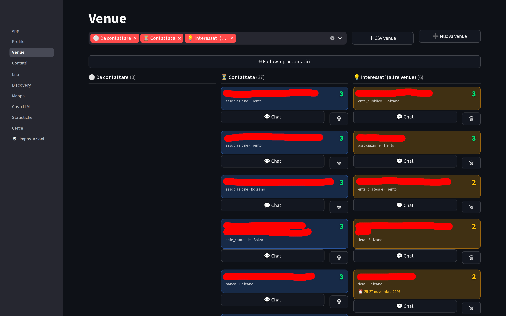
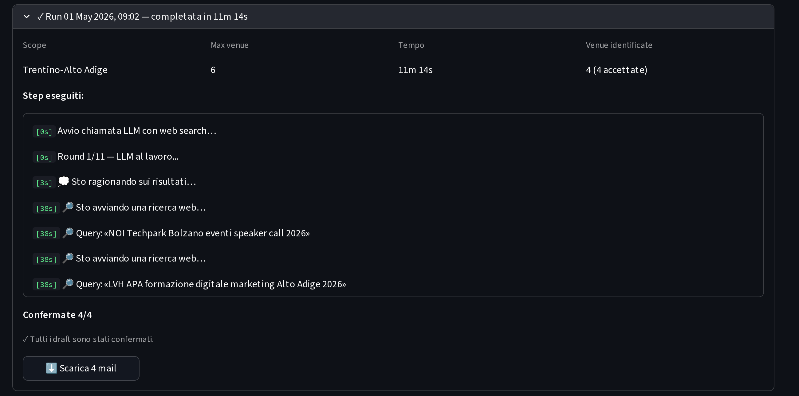
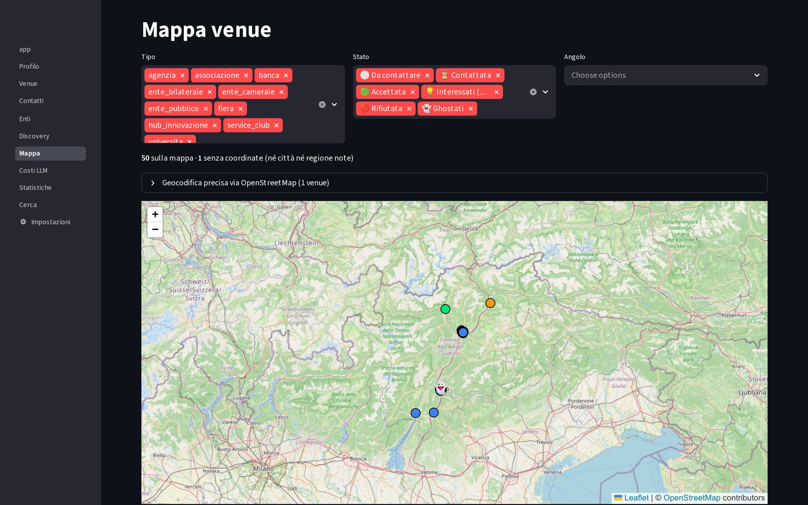
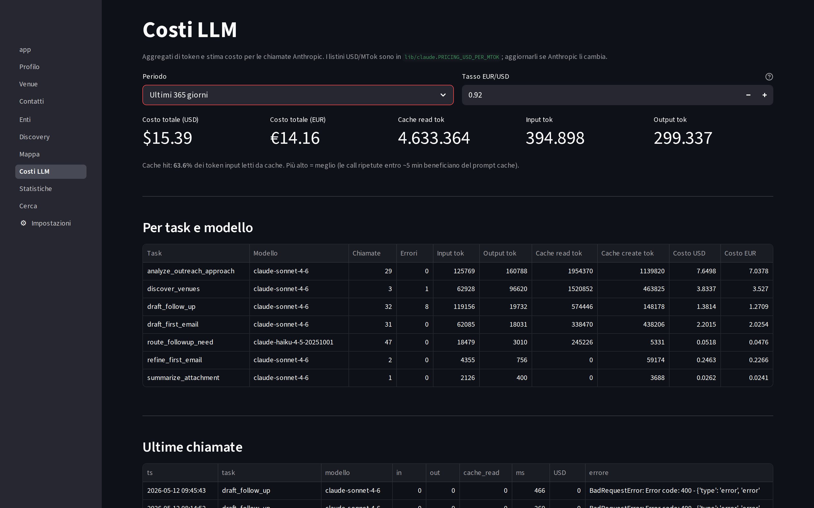
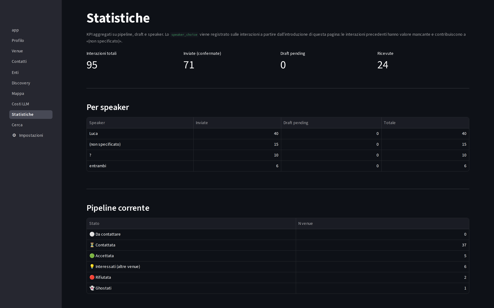

<p align="center">
  
</p>

<h1 align="center">Outreach Intelligence Tool</h1>

<p align="center">
  <em>An LLM-native CRM for high-touch, low-volume B2B outreach.</em><br>
</p>

<p align="center">
  
  
  
  
  
  <a href="LICENSE"></a>
</p>

---

## Why I built this

I do B2B outreach with Luca Nesler: we pitch ourselves as speakers and trainers to service clubs, trade fairs, innovation hubs, universities and local business
networks across Italy. The shape of that problem does not fit any CRM on the market:

| | Typical sales CRM | This use case |
|---|---|---|
| **Volume** | tens of thousands of leads | a few hundred venues |
| **Personalization** | templates + merge tags | every email must prove we understood *that* specific club |
| **Cycle length** | days to weeks | weeks to months, with planned follow-ups |
| **Channels** | email + maybe LinkedIn | email, Instagram DM, LinkedIn DM, phone, in person |

Clearly we didn't need a full-sized CRM, so I built what we needed.

## What it does

1. **Discovers** new venues via Claude with live web search, scoped by region and filtered against a
   project profile, returning structured candidates with contact, channel and fit score.
2. **Assembles a dossier** before every email: project profile, speaker bios, the venue's full history,
   the parent organization and its sibling venues, and *what was written to similar venues before*.
3. **Drafts** the email against a 750-line style guide, then accepts natural-language refinement
   ("more informal", "drop the reference to X", "cut it 30%").
4. **Hands off to the human.** You copy the draft into Aruba webmail / LinkedIn / Instagram and send it
   yourself. You then paste back what you actually sent.
5. **Analyzes replies** you paste in and advances the
   pipeline state automatically.
6. **Times follow-ups**, including telling you *not* to follow up yet.

## Screenshots

> These are real working sessions, not mockups. Prospect names are redacted where they appear.

<table>
<tr>
<td width="50%"><br><sub><b>Dashboard</b> — pipeline KPIs at a glance, plus a banner surfacing overdue follow-ups ranked by staleness.</sub></td>
<td width="50%"><br><sub><b>Venues</b> — kanban by pipeline state, with per-venue fit score and one-click entry into the conversation.</sub></td>
</tr>
<tr>
<td><br><sub><b>Discovery</b> — a completed run, replayed. Every web search the model issued is logged to the DB, so a run that took 11 minutes stays auditable afterwards.</sub></td>
<td><br><sub><b>Map</b> — venues geocoded and colored by pipeline state, filterable by type, state and angle.</sub></td>
</tr>
<tr>
<td><br><sub><b>LLM economics</b> — token and spend accounting per task and model, showing where Sonnet is worth it and where Haiku is enough. Prompt caching holds the cache-hit rate at 63%.</sub></td>
<td><br><sub><b>Statistics</b> — aggregate pipeline and interaction metrics, broken down per speaker.</sub></td>
</tr>
</table>

## Design decisions

**Anti-AI-slop.** `email_guidelines.md` is the most carefully maintained file in the repo — 750 lines of
constraints that ban *mechanisms*, not just words. Concretely:
- **Rule Zero, anti-hallucination.** For every proper noun, sector, city, number or date in the draft,
  the model must be able to point at the exact line of the project profile or speaker bio it came from.
- **Blacklists.** Banned words, banned opening patterns, banned closing
  patterns, banned self-congratulation, banned passive-aggression, and banned "explaining the recipient's
  own industry back to them."
- **Numeric budgets.** At most one "not X, but Y" construction. Zero em-dashes anywhere in the body.
  Zero colons in the pitch paragraph, where "label: explanation" is the tell-tale LLM cadence.
- **A mandatory self-check before emitting.** The model walks a numbered checklist over its own draft.
  Is the opening anchored to *them*? Is every example actually named? Does the closing ask an operational
  question rather than permission to exist? If a single item fails, it rewrites before returning.

The file is read *fresh on every call*, so tuning the prompt takes effect immediately, with no restart
and no deploy.

**A draft is not a sent email.** This tool was never meant to spam anyone. It exists to let me and my
business partner move faster on outreach we were already doing by hand, and to share the state of it
between us. The manual copy/paste is a five-second friction that guarantees a human reads every message before a prospect does.

## Architecture

**Scale:** ~11k lines of Python, 17 SQLite tables, 11 Streamlit pages, 10 domain modules.
Average cost of a drafted first email: **$0.02–0.05**.
```
┌──────────────────────────────────────────────────────┐
│  app.py + pages/     Streamlit UI (11 pages)         │
└───────────────────────┬──────────────────────────────┘
          ┌─────────────┼─────────────┐
          ▼             ▼             ▼
   ┌────────────┐ ┌───────────┐ ┌────────────┐
   │lib/claude  │ │  lib/db   │ │lib/geocode │
   │ LLM calls  │ │  SQLite   │ │ Nominatim  │
   └─────┬──────┘ └─────┬─────┘ └─────┬──────┘
         ▼              ▼             ▼
  Anthropic API   outreach.db    ~120-city cache
  Sonnet 4.6      17 tables      + OSM fallback
  + web search    FK enforced
         │
         ▼
  lib/prompts  ·  project profile  ·  speaker bios
  ·  email_guidelines.md (read fresh per call)
```